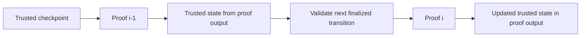
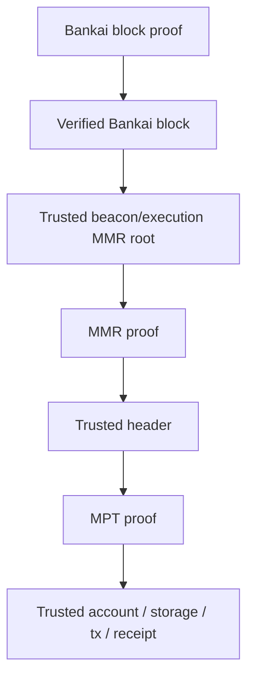

# Stateless Light Clients

This document explains the model Bankai is built on: stateless light clients for Proof-of-Stake blockchains.

It combines:

- Bankai's current SDK and backend behavior
- the Bankai research paper
- the Bankai Substack explainer
- external reference material on Ethereum light clients and weak subjectivity

The goal is to give one precise mental model for how Bankai works, what it proves, and where its trust boundaries are.

## Executive Summary

A stateless light client is a light client whose verifier does not need persistent on-chain state.

Instead of storing the latest committee, validator set commitment, or client state in a contract, the state is carried forward inside a recursive proof chain. Each new proof verifies the previous proof, uses the previous proof's public output as trusted input, validates the next state transition, and exposes the updated state as its own public output.

For Bankai, that means:

- Ethereum light-client sync happens fully off-chain
- the proof itself becomes the portable trust anchor
- verification can happen on demand, anywhere
- historical headers and concrete EVM objects can be recovered from commitments anchored in a verified Bankai block
- the same model can expand from one chain family to many chains behind one proof-oriented interface

This is different from a conventional stateful light client, where a verifier contract must be kept continuously synchronized with the source chain.

## Current Scope and Long-Term Vision

Bankai should be described in two layers:

- current product scope
- long-term protocol vision

### Current product scope

Today, Bankai starts from Ethereum.

That includes:

- Ethereum L1 as the core stateless light-client foundation
- Ethereum beacon and execution proof flows
- supported OP Stack chains exposed through the same Bankai verification model

So the current story is already multi-chain, but it is still centered on Ethereum plus Ethereum-linked L2s.

### Long-term protocol vision

The larger vision is broader than Ethereum.

Bankai aims to become a general light-client layer for many chains, not just one chain family. The target end state is:

- support a large number of chains
- expand beyond Ethereum and Ethereum L2s into additional L1s
- expose those chains through one consistent proof interface
- make data from many chains accessible through a single zk-proof-based trust model

The simplest way to say this is:

> Bankai starts with Ethereum, but the destination is a universal proof layer where many chains can be accessed through one unified zk verification flow.

That vision matters because the product is not just "an Ethereum light client." Ethereum is the first full instantiation of a broader stateless-light-client architecture.

## The Problem Stateless Light Clients Solve

Light clients for PoS chains are harder than light clients for PoW chains.

In PoW, historical security can be reduced to cumulative work. In PoS, the client has to reason about:

- changing validator sets
- committee handoffs
- finality
- weak subjectivity

That usually pushes implementations toward a stateful contract model:

1. deploy a verifier contract on the destination chain
2. initialize it with trusted source-chain state
3. keep updating that contract as validator or committee state changes

That approach works, but it has recurring costs and operational overhead:

- perpetual sync transactions
- duplicated deployments across chains
- a separate state silo per destination environment
- ongoing maintenance even when nobody is using the client

Bankai's design goal is to remove that always-on destination-side state.

## Stateful vs Stateless Light Clients

### Stateful light client

A stateful light client stores trusted client state in the verifier environment itself.

Examples of stored state:

- current sync committee commitment
- current validator set commitment
- latest trusted checkpoint

To advance the client, a proof updates the contract's storage. The contract's stored state is what prevents a malicious prover from presenting a proof built over the wrong signer set.

### Stateless light client

A stateless light client moves that trusted state into the proof chain.

Instead of:

- contract storage as the source of truth

it uses:

- previous proof output as the source of truth

Each proof does two jobs:

1. verify the previous proof
2. verify the next canonical state transition

This turns the proof chain itself into the storage medium.

The verifier only needs a self-contained proof plus the expected verification identity for the Bankai program. It does not need a continuously updated light-client contract state.

## What "Stateless" Means Here

"Stateless" does not mean the whole system has no state.

It means the verifier does not need persistent state to verify the client soundly.

Important distinction:

- the prover still tracks source-chain data off-chain
- Bankai's backend still stores snapshots, headers, and proof material operationally
- the source chain obviously remains stateful

The statelessness claim is specifically about the verification interface and trust anchor.

## The Core Recursive Model

At a high level, the recursive model is:



For period `i`, proof `pi` attests to:

1. the previous proof `p(i-1)` is valid
2. the transition from state `S(i-1)` to `S(i)` is valid under the source chain's rules

This gives a verifier a single portable certificate for the entire validated history from a trusted checkpoint up to the latest proven state.

## Why Finality Is Central

Stateless light clients need an objective notion of the canonical chain.

Bankai's research approach does not try to run an internal fork-choice rule inside the verifier. Instead, it tracks the chain as defined by the source protocol's finality gadget.

That is the key move:

- fork choice is outsourced to the source chain
- the proof only certifies finalized, canonical state transitions
- the verifier stays simple and stateless

For Ethereum, this relies on Casper FFG finality and sync-committee-based light-client updates.

## Ethereum Instantiation

Ethereum is a good fit for this design because it provides:

- deterministic finality
- publicly verifiable committee selection
- sync committees designed for light clients
- aggregate BLS signatures that are relatively efficient to verify in ZK

### The essential Ethereum objects

For the Ethereum version of the design, the proof chain revolves around:

- a trusted prior client state
- a new beacon header
- a sync committee aggregate signature over that header
- public keys and Merkle witnesses for participating signers
- an execution header and SSZ proof showing it is committed by the beacon block
- committee transition data when the sync committee rotates

### What the transition proof checks

In the paper's formal model, each transition verifies:

1. the previous proof is valid, or this is the trusted genesis/checkpoint step
2. participating sync committee members belong to the previously trusted committee root
3. the aggregate BLS signature is valid for the new beacon header
4. the execution header is correctly decommitted from the beacon block body
5. committee handoff rules are applied correctly when the period boundary is reached
6. the new public output matches the newly computed trusted state

### Why sync committees matter

Ethereum light clients do not verify every validator signature in every epoch. They rely on a sync committee, a dedicated subset of validators that signs headers for light clients.

That gives Bankai a compact and protocol-native light-client surface:

- committee signatures advance trust
- committee roots can be carried between recursive proofs
- execution state can be reached by proving the execution payload header committed by the beacon chain

## Forks, Weak Subjectivity, and the Bankai Security Model

### Forks

Fork resolution is handled off-chain by the prover following the source chain's canonical finalized history.

If a short-range reorg happens before finality:

- the prover may discard work on the losing branch
- a new proof chain is built from the last valid point

The verifier does not resolve forks itself. It relies on source-chain finality.

### Weak subjectivity

Weak subjectivity is a core challenge for PoS light clients: a client cannot safely bootstrap from arbitrary deep history without some trusted checkpoint discipline.

Bankai does not eliminate the need for trusted initialization. It changes what happens after initialization.

The model is:

- initialize once from a trusted checkpoint
- thereafter carry trust forward cryptographically through recursion

This is stronger than a naive stateless claim. The client is not "trust-free from nothing." It is "stateless after trusted bootstrap."

### What Bankai claims to improve

Compared with a stateful contract light client, Bankai's design aims to improve:

- portability
- on-demand verification
- infrastructure reuse across chains
- elimination of perpetual destination-side sync costs

## Bankai's Product Architecture

The research paper presents the recursive light-client core. The current Bankai product adds a packaging layer around that idea so developers can fetch and verify concrete objects, not just chain head state.

The Bankai product flow is:

1. verify a Bankai block proof
2. trust the commitments embedded in the verified Bankai block
3. use MMR proofs to recover trusted headers
4. use those trusted headers to verify MPT proofs for accounts, storage, transactions, and receipts

### Bankai block as trust anchor

A verified Bankai block is the trust anchor for the rest of the product.

Today, Bankai blocks include commitments for:

- Ethereum beacon state
- Ethereum execution state
- OP Stack client commitments
- Bankai's own block history

In the SDK types, a `BankaiBlock` carries:

- `version`
- `program_hash`
- `prev_block_hash`
- `bankai_mmr_root_keccak`
- `bankai_mmr_root_poseidon`
- `block_number`
- `beacon`
- `execution`
- `op_chains`

The beacon section includes:

- current slot and header root
- beacon state root
- justified and finalized heights
- signer participation summary
- keccak and poseidon MMR roots
- current and next validator roots

The execution section includes:

- current execution height and header hash
- justified and finalized heights
- keccak and poseidon MMR roots

### Proof identity and `program_hash`

The SDK README explicitly recommends checking `program_hash` if you pin a specific Bankai deployment or release.

That matters because verifying a proof is not enough on its own if you also care which proving program produced it. In practice:

- the proof must be valid
- the Bankai block hash must match the committed block payload
- the proving program identity should match what your application expects

## MMRs in Bankai

Bankai uses Merkle Mountain Ranges to commit historical headers.

This is what allows a verified Bankai block to serve as a launch point for recovering earlier headers and then verifying concrete EVM objects under those headers.

In the current product, Bankai exposes:

- beacon MMR roots and MMR proofs
- execution MMR roots and MMR proofs
- OP Stack MMR proofs after OP client decommitment

The verifier flow in `bankai-verify` is:

1. hash the target header into the correct MMR leaf format
2. verify the MMR inclusion path
3. recompute the MMR root from the proof peaks
4. compare it to the trusted root from the verified Bankai block context

### Important research-to-product nuance

The research paper's proof-of-concept evaluates the recursive client core and calls historical header accumulation via an MMR a future extension that would raise recursive proving cost.

The current Bankai SDK and backend already expose MMR-root-based historical proof flows.

The best interpretation is:

- the paper describes the core recursive light-client construction and its evaluation baseline
- the current Bankai product layers historical header commitments and proof-serving infrastructure on top of that foundation

That is an inference from the paper plus the present SDK/backend surface, but it is the most accurate way to reconcile the two.

## The End-to-End Verification Flow

For Ethereum, the Bankai product verification path is:



Concretely:

1. verify the Bankai block proof
2. check the block hash against the supplied `BankaiBlock`
3. optionally pin `program_hash`
4. select the relevant MMR root from the verified block
5. verify the header's MMR inclusion proof
6. use the trusted header roots to verify account, storage, transaction, or receipt proofs

For OP Stack there is one extra step:

1. verify the Bankai block proof
2. decommit the relevant OP client from the `op_chains` commitment using a Merkle proof
3. read the OP client's MMR root
4. verify the OP header with an MMR proof
5. verify account, storage, transaction, or receipt proofs under that trusted OP header

## What the SDK and API Expose Today

The Bankai SDK packages this verification path into proof bundles.

A proof bundle contains:

- a Bankai block proof
- the Bankai block it is supposed to authenticate
- Ethereum proofs when requested
- OP Stack proofs when requested

In the current SDK types, that block proof is an STWO/Cairo proof carried as `ProofBundle.block_proof`.

The main user flow is:

1. fetch data and proofs with `bankai-sdk`
2. verify them with `bankai-verify`
3. consume the verified results in an app or proving system

Current Ethereum proof families include:

- beacon headers
- execution headers
- accounts
- storage slots
- transactions
- receipts

Current OP Stack proof families include:

- headers
- accounts
- storage slots
- transactions
- receipts

The public API also exposes lower-level endpoints for:

- snapshots
- MMR roots
- MMR proofs
- light-client proof bundles

## Finality Modes in Bankai

For Ethereum, Bankai mirrors Ethereum's finality vocabulary:

- `latest`
- `justified`
- `finalized`

The intended ordering is:

```text
latest >= justified >= finalized
```

Operationally:

- `finalized` is the safest default for trust-sensitive uses
- `justified` and `latest` trade stronger settlement for fresher data

These selectors choose the Bankai view used to anchor the proof bundle.

## OP Stack: Important Current Limitation

Bankai's current OP Stack story is not identical to its Ethereum stateless light-client story.

Per the SDK docs, today's OP Stack support is:

- based on proposer FDG submissions
- limited to claimed roots from the registered proposer
- still trusting the sequencer for submitted OP state
- linked to Ethereum L1 finality rather than native OP finality

So:

- Ethereum is the cleanest expression of the stateless-light-client thesis
- OP Stack support currently uses a narrower, L1-linked trust model

That distinction should be explicit in any Bankai product documentation.

## What Bankai Makes Portable

The important portability property is not "a proof of one header."

It is "a reusable verification boundary."

A verified Bankai artifact can be consumed:

- by an off-chain application
- by another proof system
- by a zkVM
- by a destination-chain verifier contract

The SDK docs emphasize this point: the same proof bundle structure can be used in applications and in proving systems.

The Substack post also describes a deployment model where the final recursive proof is wrapped in Groth16 so a standard verifier contract can cheaply verify it on many chains. That is the on-chain version of the same portability story.

So the clean way to describe Bankai today is:

- off-chain and SDK verification: verify the STWO-backed Bankai block proof directly
- destination-chain deployment model: wrap the final recursive proof for cheap stateless on-chain verification

## Why Multi-Chain Matters To Bankai

Bankai's long-term value is not only that it can verify one chain cheaply.

It is that the same proof-oriented access pattern can be reused across many chains. That creates a simpler developer experience:

- one verification mindset
- one proof-driven trust boundary
- one system that can keep expanding as more chains are added

From a docs-page perspective, this is the right framing:

- today: Bankai gives trust-minimized access to Ethereum and supported Ethereum-linked chains
- next: Bankai adds additional L1s
- long term: Bankai becomes a unified access layer for a large cross-chain world, with verification centered on zk proofs rather than bespoke per-chain client infrastructure

## What Stateless Light Clients Do Not Automatically Give You

Statelessness does not remove all tradeoffs.

It does not automatically solve:

- bootstrap trust
- source-chain finality latency
- prover complexity
- proof-generation cost
- data availability requirements for the prover
- product-level policy decisions around which Bankai program hashes or deployments to trust

It also does not mean all supported chains share the same trust assumptions.

## Practical Verification Guidance

For Bankai users, the right default checklist is:

1. start from a finalized Bankai view unless you explicitly need fresher data
2. verify the Bankai block proof
3. verify the Bankai block hash against the supplied block payload
4. pin and check `program_hash` if your application depends on a specific Bankai release or deployment
5. verify the relevant MMR proof for the target header
6. only then verify and consume the downstream MPT proof

For OP Stack, add:

7. verify the OP client decommitment from the `op_chains` commitment before trusting the OP MMR root

## Recommended Product Messaging

If Bankai needs one short canonical definition, it should be:

> Bankai is a stateless light-client layer: it syncs PoS light clients fully off-chain, compresses their trusted state into portable proofs, and lets applications verify headers and EVM state on demand without running or maintaining a destination-side light-client contract.

If Bankai needs one short caveat, it should be:

> Stateless does not mean trustless-from-nothing. Bankai still relies on trusted bootstrap, source-chain finality, proof-system soundness, and explicit program identity checks.

## References

Primary Bankai sources:

- Bankai SDK README: [https://github.com/bankaixyz/bankai-sdk](https://github.com/bankaixyz/bankai-sdk)
- Bankai research paper, "Stateless Light Clients for PoS Blockchains": [https://cdn.prod.website-files.com/684c03db8ff22a3ad7706bfc/690228ed425232af0e961bc8_main%20(2).pdf](https://cdn.prod.website-files.com/684c03db8ff22a3ad7706bfc/690228ed425232af0e961bc8_main%20(2).pdf)
- Bankai Substack explainer, published October 29, 2025: [https://bankaixyz.substack.com/p/stateless-light-clients-explained](https://bankaixyz.substack.com/p/stateless-light-clients-explained)

External references:

- Ethereum.org, weak subjectivity: [https://ethereum.org/en/developers/docs/consensus-mechanisms/pos/weak-subjectivity/](https://ethereum.org/en/developers/docs/consensus-mechanisms/pos/weak-subjectivity/)
- Ethereum consensus specs, light client sync protocol: [https://ethereum.github.io/consensus-specs/specs/altair/light-client/sync-protocol/](https://ethereum.github.io/consensus-specs/specs/altair/light-client/sync-protocol/)
- Telepathy protocol overview: [https://docs.telepathy.xyz/telepathy-protocol/overview](https://docs.telepathy.xyz/telepathy-protocol/overview)
